<p align="center">
  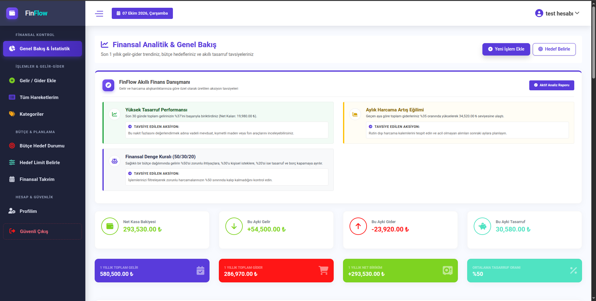
</p>

<h1 align="center">FinFlow - Akıllı Kişisel Finans & Bütçe Yönetimi</h1>

<p align="center">
  <b>Smart Personal Finance, Budget Planning & Financial Health Platform</b><br>
  Modern, responsive, user-friendly, and intelligent financial tracker built with ASP.NET Core & PostgreSQL.
</p>

<p align="center">
  
  
  
  
  
</p>

---

## Dil / Language
- [Türkçe Dokümantasyon](#-türkçe-dokümantasyon)
  - [Proje Hakkında](#-proje-hakkında)
  - [Öne Çıkan Özellikler & Ekran Görüntüleri](#-öne-çıkan-özellikler--ekran-görüntüleri)
  - [Teknik Altyapı](#-teknik-altyapı--teknolojiler)
  - [Kurulum & Çalıştırma](#-kurulum--çalıştırma-adımları)
- [English Documentation](#-english-documentation)
  - [About The Project](#-about-the-project)
  - [Key Features & Screenshots Showcase](#-key-features--screenshots-showcase)
  - [Technical Stack](#-technical-stack--architecture)
  - [Getting Started](#-getting-started)

---

# 🇹🇷 Türkçe Dokümantasyon

## 📌 Proje Hakkında
**FinFlow**, bireysel finans yönetimini karmaşık tablolardan ve sıkıcı hesaplardan kurtarıp; kullanıcıyı yönlendiren, harcamalarını analiz eden, bütçe aşımı durumlarında dinamik aksiyon önerileri sunan **akıllı bir finans ve bütçe yönetim platformudur**.

Kullanıcıların gelir ve harcamalarını kaydetmelerini, kategorize etmelerini, son 1 yıllık trendlerini grafiklerle incelemelerini ve bütçe hedeflerini interaktif bir takvim üzerinden takip etmelerini sağlar.

---

## 📸 Öne Çıkan Özellikler & Ekran Görüntüleri

### 1. Giriş & Kayıt Deneyimi (Auth Modülü)
Modern ve sade arayüz ile güvenli oturum yönetimi.

| Giriş Yap (Login) | Kayıt Ol (Register) |
| :---: | :---: |
| 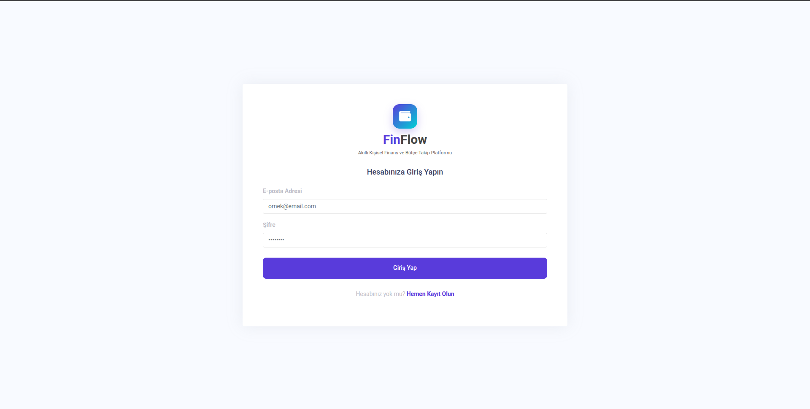 | 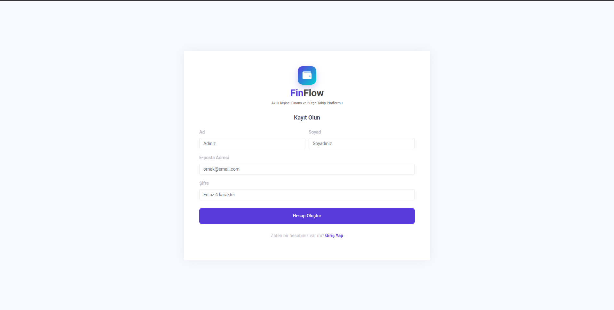 |
| *Hızlı kimlik doğrulama ve şifreli oturum.* | *Yeni kullanıcı hesabı oluşturma.* |

---

### 2. Akıllı Finans Danışmanı & Ana Kontrol Paneli (Dashboard)
Finansal sağlığınızı tek bakışta özetleyen KPI kartları ve kural tabanlı tavsiye motoru.

<p align="center">
  
</p>

- **Canlı Finansal Sağlık Analizi:** Tasarruf oranlarınızı anlık olarak analiz eder ve acil durum fonu / yatırım önerileri sunar.
- **Kritik Eşik Uyarıları:** Bir harcama kalemi aylık bütçenizin %35'inden fazlasını kapladığında otomatik uyarı verir.
- **50/30/20 Kuralı Rehberliği:** Gelirinizi %50 zorunlu ihtiyaçlar, %30 kişisel istekler ve %20 birikim olarak dengede tutmanız için rehberlik sağlar.
- **Önerilen Aksiyonlar:** Her analiz kartında kullanıcıya özel, somut aksiyon adımları listeler.

---

### 3. Yıllık Finansal Trendler & Kategori Analiz Grafikleri
12 aylık geçmişinizi ve harcama alışkanlıklarınızı görselleştiren interaktif grafikler.

<p align="center">
  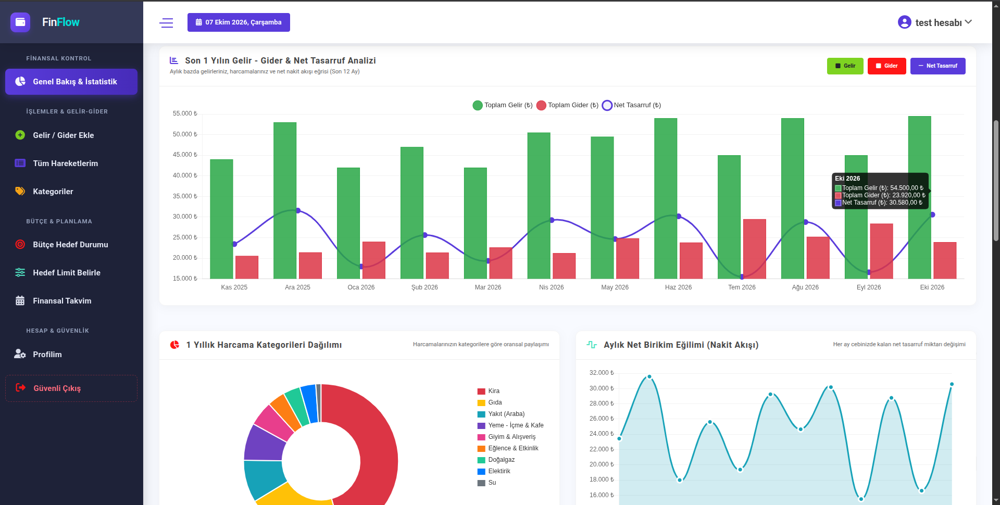
</p>

- **12 Aylık Karşılaştırmalı Grafikler (Chart.js):** Gelir sütunları, gider sütunları ve aylık net tasarruf eğrisi.
- **Kategori Dağılım Grafiği (Donut Chart):** Giderlerin kategorilere göre oransal ağırlığı.
- **Aylık Net Bakiye Eğilimi:** Nakit akışının artı/eksi seyrini gösteren trend analizi.

---

### 4. Gelir / Gider Ekleme & Hareket Defteri (İşlemlerim)
Kolay veri girişi, hızlı arama, filtreleme ve özet göstergeler.

| İşlem Ekleme (Gelir / Gider) | İşlem Listesi & Filtreleme |
| :---: | :---: |
| 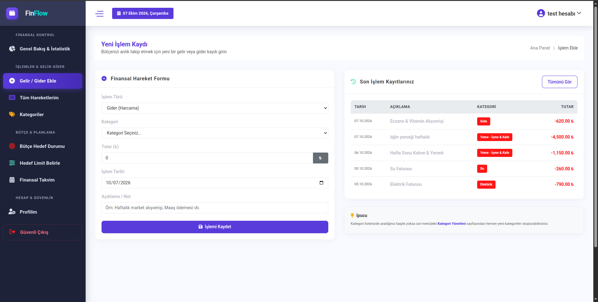 | 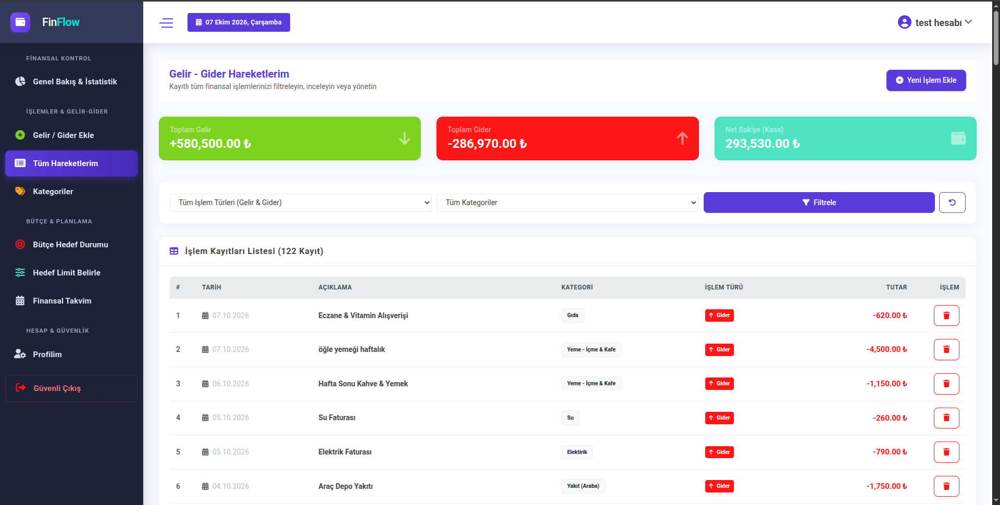 |
| *Kategori, tarih ve tutar bazlı hızlı işlem girişi.* | *Tarih aralığı, tür ve kategoriye göre filtreleme & toplam şeridi.* |

---

### 5. Kategori Yönetimi
Kişiselleştirilmiş harcama ve gelir kategorileri.

<p align="center">
  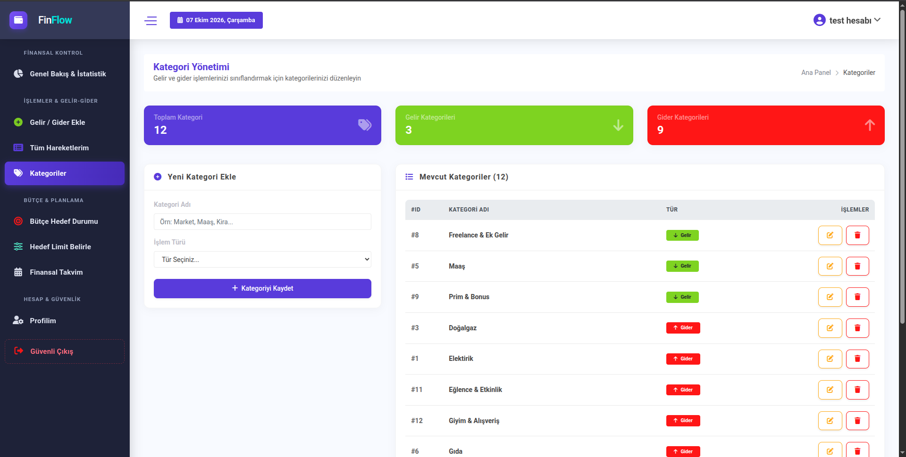
</p>

- Yeni kategoriler oluşturma, düzenleme ve silme.
- Kategorilere özel renk kodlaması ve işlem sayısı takibi.

---

### 6. Bütçe Hedefleri, İlerleme Çubukları & Akıllı Bildirimler
Harcamalarınızı kontrol altında tutmak için kategori bazlı aylık bütçe limitleri.

| Bütçe Durumu & Akıllı Bildirimler | Bütçe İlerleme Kartları |
| :---: | :---: |
| 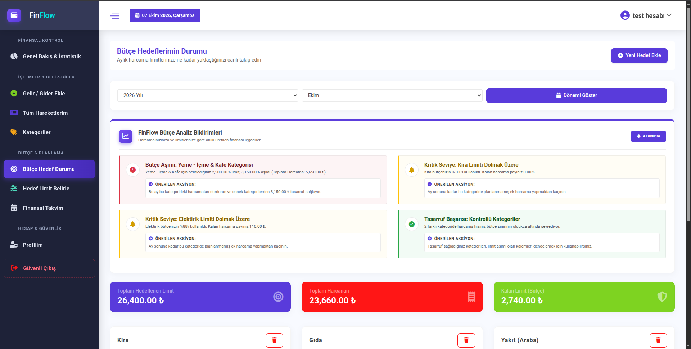 | 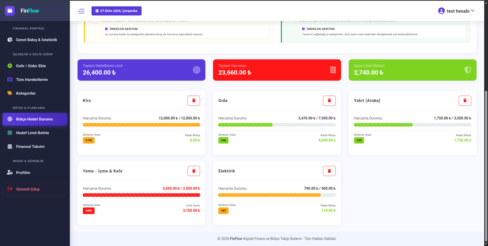 |
| *Limit aşımlarında uyarılar ve başarı tebrik bildirimleri.* | *Yeşil (<%80), sarı (%80-100) ve kırmızı (>%100) durum çubukları.* |

<br>

<p align="center">
  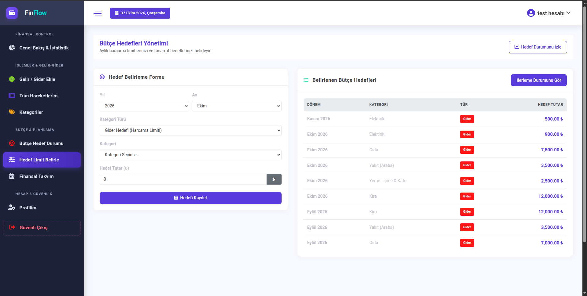
  <br>
  <em>Yeni aylık kategori harcama limiti tanımlama arayüzü.</em>
</p>

---

### 7. Etkileşimli Finansal Takvim & Bütünsel Günlük Rapor
Finansal hareketlerinizi takvim üzerinde gün bazında görüntüleyin.

| Takvim Görünümü & Filtreler | Bütünsel Günlük Detay Penceresi |
| :---: | :---: |
| 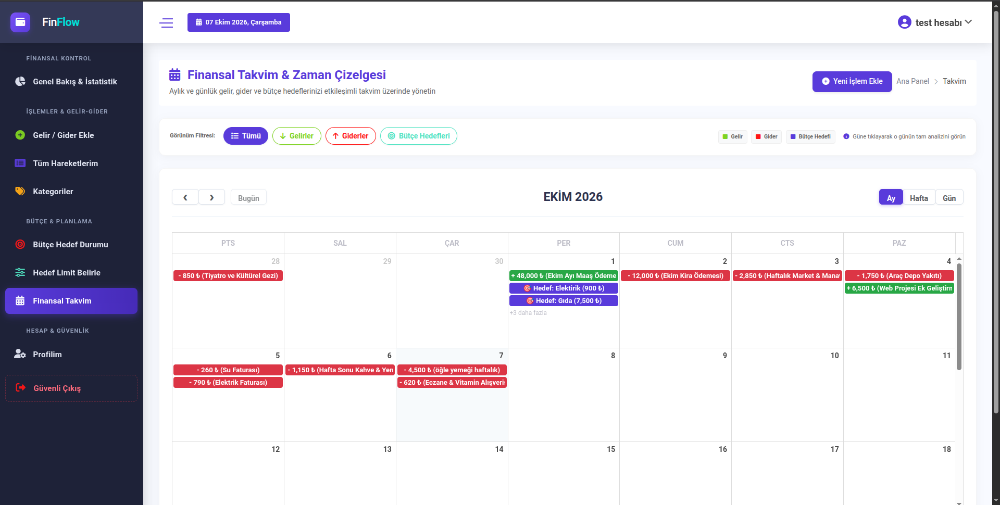 | 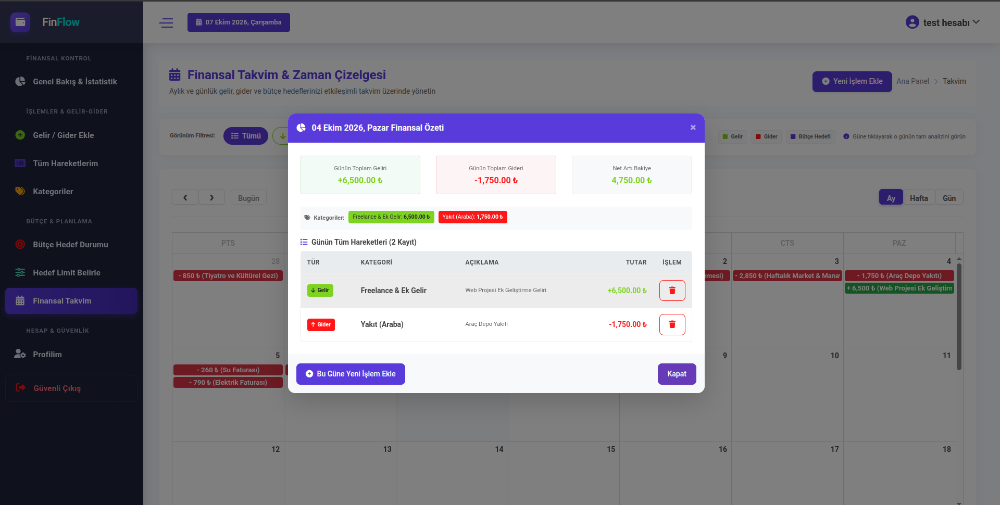 |
| *Ayrık Gelir, Gider ve Bütçe Hedefi filtreleme butonları.* | *Seçilen günün tüm gelir, gider, net bakiye ve işlem listesi özeti.* |

---

## 🛠️ Teknik Altyapı & Teknolojiler

| Katman | Teknoloji / Kütüphane |
|---|---|
| **Framework** | .NET 8.0 (C# / ASP.NET Core MVC) |
| **ORM** | Entity Framework Core 8.0 (Code-First & Migrations) |
| **Veritabanı** | PostgreSQL (Npgsql.EntityFrameworkCore.PostgreSQL) |
| **Oturum Yönetimi** | ASP.NET Core Session & Cookie Güvenliği |
| **Arayüz (Frontend)** | HTML5, CSS3, JavaScript (ES6+), Bootstrap 4 / Focus-2 |
| **Grafikler & Takvim** | Chart.js 2.8, FullCalendar, Moment.js, jQuery UI |
| **İkonlar & Bildirimler**| FontAwesome 6, SweetAlert2 |

---

## 🚀 Kurulum & Çalıştırma Adımları

### 1. Gereksinimler
- [.NET 8.0 SDK](https://dotnet.microsoft.com/download/dotnet/8.0)
- [PostgreSQL](https://www.postgresql.org/) (veya Docker)

### 2. Depoyu Klonlayın
```bash
git clone https://github.com/emirhandurmus/KisiselFinansTakip.git
cd KisiselFinansTakip
```

### 3. Veritabanı Ayarları (`appsettings.json`)
`KisiselFinansTakip/appsettings.json` dosyasında PostgreSQL bağlantı cümlenizi düzenleyin:
```json
{
  "ConnectionStrings": {
    "DefaultConnection": "Host=localhost;Port=5432;Database=FinansTakipDb;Username=postgres;Password=your_password"
  }
}
```

### 4. Veritabanı Şemasını Uygulayın
```bash
dotnet ef database update --project KisiselFinansTakip
```

### 5. Projeyi Başlatın
```bash
dotnet run --project KisiselFinansTakip
```
Tarayıcınızdan `http://localhost:5074` adresine giderek uygulamayı kullanmaya başlayabilirsiniz.

---
---

# 🇬🇧 English Documentation

## 📌 About The Project
**FinFlow** is a modern personal finance and cash flow management web application designed to transform raw expense tracking into an **engaging, intelligent financial health companion**.

Built with ASP.NET Core 8 and PostgreSQL, FinFlow provides dynamic financial insights, proactive budget alarms, interactive calendar-based daily ledger analysis, and full-year comparative charts.

---

## 📸 Key Features & Screenshots Showcase

### 1. Authentication Experience
Clean, secure sign-in and registration flow.

| Sign In (Login) | Sign Up (Register) |
| :---: | :---: |
|  |  |
| *Session-based authentication.* | *Fast new user account registration.* |

---

### 2. Smart Financial Advisor & Main Dashboard
At-a-glance financial health KPIs and rule-based dynamic advisory cards.

<p align="center">
  
</p>

- **Real-Time Savings Rate Detection:** Evaluates cash savings velocity and recommends liquid emergency funds or investment instruments.
- **Heavy Expense Outlier Alert:** Detects categories exceeding 35% of total monthly outflow.
- **50/30/20 Budget Rule Companion:** Evaluates essential needs vs. wants vs. savings balance.
- **Actionable Steps:** Every insight card includes direct, actionable financial recommendations.

---

### 3. Annual Financial Analytics & Visual Trends
Interactive data visualization highlighting cashflow trends and distribution.

<p align="center">
  
</p>

- **12-Month Comparative Charts (Chart.js):** Income bars, expense bars, and net cashflow trends.
- **Expense Category Doughnut Chart:** Annual and monthly percentage breakdown.
- **Monthly Net Cashflow Curve:** Real-time visibility into savings balance trajectory.

---

### 4. Transaction Entry & Ledger List
Effortless transaction logging and robust filtering capabilities.

| Add Transaction | Transactions Ledger & Filters |
| :---: | :---: |
|  |  |
| *Categorized income and expense logging form.* | *Date-range, type, and category filters with live summary ribbon.* |

---

### 5. Category Management
Customizable income and expense categories.

<p align="center">
  
</p>

- Create, update, and delete categories.
- Category color badges and transaction frequency tracking.

---

### 6. Budget Targets, Progress Bars & Smart Alarms
Category-level monthly spending limits with proactive status feedback.

| Budget Status & Smart Notifications | Progress Bar Cards |
| :---: | :---: |
|  |  |
| *Proactive over-budget warnings and discipline praise.* | *Color-coded progress: Green (<80%), Warning (80-100%), Red (>100%).* |

<br>

<p align="center">
  
  <br>
  <em>Custom monthly category expenditure limit creation modal/form.</em>
</p>

---

### 7. Interactive Financial Calendar & Holistic Daily Ledger
Visualize cash events on a calendar view with detailed daily breakdowns.

| Calendar View & Filters | Holistic Daily Modal Breakdown |
| :---: | :---: |
|  |  |
| *Separated filter pills for Income, Expense, and Targets.* | *Single-click holistic view of daily income, expense, net balance, and item list.* |

---

## 🛠️ Technical Stack & Architecture

| Layer | Technology |
|---|---|
| **Backend Framework** | .NET 8.0 (C# / ASP.NET Core MVC) |
| **Data Access / ORM** | Entity Framework Core 8.0 |
| **Database** | PostgreSQL via Npgsql Driver |
| **Authentication** | Session State & Antiforgery Tokens |
| **Frontend UI** | HTML5, CSS3, JavaScript (ES6+), Bootstrap 4, Focus-2 Theme |
| **Data Visualization** | Chart.js, FullCalendar, Moment.js |
| **Icons & Modals** | FontAwesome 6, SweetAlert2 |

---

## 🚀 Getting Started

### 1. Prerequisites
- [.NET 8.0 SDK](https://dotnet.microsoft.com/download/dotnet/8.0)
- [PostgreSQL](https://www.postgresql.org/) (Local or Docker container)

### 2. Clone the Repository
```bash
git clone https://github.com/emirhandurmus/KisiselFinansTakip.git
cd KisiselFinansTakip
```

### 3. Configure Database Connection (`appsettings.json`)
Edit `KisiselFinansTakip/appsettings.json` with your credentials:
```json
{
  "ConnectionStrings": {
    "DefaultConnection": "Host=localhost;Port=5432;Database=FinansTakipDb;Username=postgres;Password=your_password"
  }
}
```

### 4. Apply Database Migrations
```bash
dotnet ef database update --project KisiselFinansTakip
```

### 5. Run the Application
```bash
dotnet run --project KisiselFinansTakip
```
Navigate to `http://localhost:5074` in your browser.

---

## 📄 License
This project is licensed under the MIT License - see the [LICENSE](LICENSE) file for details.
